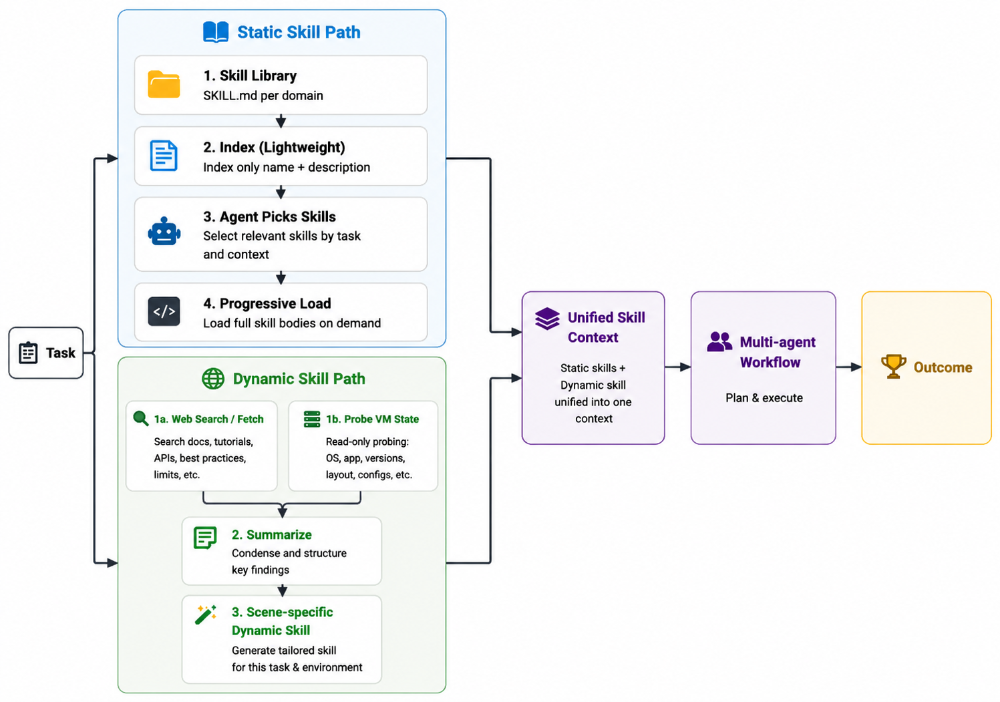

[🇺🇸 English](./README.md)

# Intelligence Indeed

Intelligence Indeed（代码中简称 tars）是一个面向桌面 GUI 自动化的 multi-agent computer-use 系统。它是融合 static skill 与 dynamic skill 的混合式智能体框架：static skill 通过渐进式披露提供系统提示与通用参考，dynamic skill 由任务可行性探测模块实时生成。二者贯穿全流程共同引导执行，既保持信息独立，又统一各阶段的执行经验。

本仓库是集成了 Intelligence Indeed agent、用于官方评测的 [OSWorld](https://github.com/xlang-ai/OSWorld) 快照。

## 方法

### 动机

在 multi-agent computer-use 场景中，有两类问题常会限制可靠性。其一，早期环境探测与联网检索往往已发现有用约束，但这些发现未必能系统化地传给后续阶段，规划与执行仍接近从零开始。其二，智能体常被给予混杂多领域规则的长提示，无关指引会稀释有效偏好，并推高上下文成本。

Intelligence Indeed 用一套混合 skill 系统同时应对这两点。**Static skills** 提供可复用的领域指导；**dynamic skills** 承载来自实时探测与检索的任务实例信息。二者贯穿 multi-agent 全流程，既区分信息职责，又对齐各阶段的执行偏好。

### 概览

系统以 multi-agent 流水线完成桌面任务。接到指令后，先从 static skill index 中按需挑选并装载相关领域技能，再结合环境探测与联网检索生成面向当前任务的 dynamic skill；随后各阶段 agent 在统一的技能上下文下完成规划与执行。

<p align="center">
  
</p>

### Static skills

Static skills 是一些通用性的操作指南。每个 skill 保存用于模型发现的元数据（`name`、`description`）以及领域规则与偏好正文。

该智能体通过渐进式披露（progressive disclosure）加载 Static skills，确保无关信息不进入上下文，从而减少跨领域干扰与额外 token 开销。若后续探测发现遗漏领域，仍可补选。

### Dynamic skills

Dynamic skills 按任务实例实时生成，不写入静态库。Agent 对运行环境做只读探测（资源、应用状态、界面可达性等），并在需要时检索或抓取文档以核实能力与 GUI 路径。这些信号被总结为场景专属的 dynamic skill，指导后续的任务执行全程。

## OSWorld Benchmark Performance

Intelligence Indeed 在 OSWorld 基准上评测，使用 361 题子集（不含 Google Drive 任务）。

**评测模型：**
- **核心执行模型：** `claude-opus-4-7`

**总体表现：**
- **总分：** 325.59 / 361
- **平均分：** 90.19%

**分领域得分：**

| Domain | Score | Total Tasks |
| :--- | :---: | :---: |
| Chrome | 35.93 | 46 |
| GIMP | 24.0 | 26 |
| LibreOffice Calc | 46.0 | 47 |
| LibreOffice Impress | 42.96 | 47 |
| LibreOffice Writer | 22.0 | 23 |
| Multi Apps | 78.81 | 93 |
| OS | 24.0 | 24 |
| Thunderbird | 13.0 | 15 |
| VLC | 16.89 | 17 |
| VS Code | 22.0 | 23 |

## Agent 与评测入口

- Agent 包：[`mm_agents/intelligence_indeed/`](mm_agents/intelligence_indeed/)
- Agent README / 安装说明：[`mm_agents/intelligence_indeed/README.md`](mm_agents/intelligence_indeed/README.md)
- Desktop env 适配：[`desktop_env/desktop_env_tars.py`](desktop_env/desktop_env_tars.py)
- 多环境 runner：[`scripts/python/run_multienv_tars.py`](scripts/python/run_multienv_tars.py)

## 快速开始（OSWorld nogdrive）

```bash
python3 -m venv .venv
source .venv/bin/activate
pip install -r requirements.txt

# 配置仓库根目录 .env（AWS_* + Anthropic / Parallel keys）
# 详见 mm_agents/intelligence_indeed/README.md

python scripts/python/run_multienv_tars.py \
  --provider_name aws --region us-east-1 --headless \
  --test_all_meta_path evaluation_examples/test_nogdrive.json \
  --result_dir ./results/tars-nogdrive-full \
  --num_envs 6 --max_steps 100
```

## 关于 OSWorld

本仓库包含用于评测的完整 OSWorld 代码树。上游 benchmark、文档与许可证见 [xlang-ai/OSWorld](https://github.com/xlang-ai/OSWorld)（Apache-2.0）。原始上游 README 保留为 [`OSWORLD_README.md`](OSWORLD_README.md)。

## 致谢

感谢 Pointer、Agent-S、VLAA 团队，以及更广泛的 OSWorld agent 社区，为 Intelligence Indeed 的研发提供了开放研究与工具支持。
